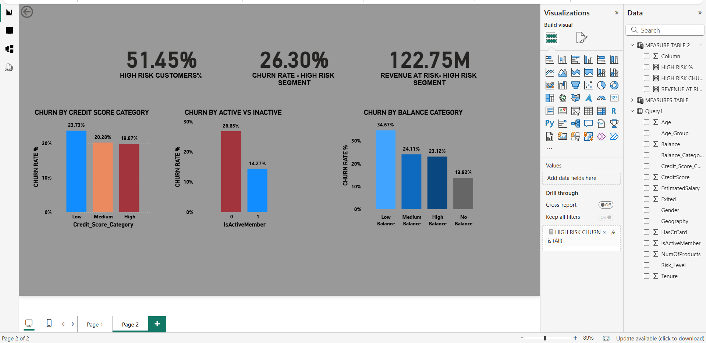

# Banking-Customer-Churn-Risk-Analysis
End-To-End Banking Customer churn &amp; Risk Analysis Using Excel, Sql, And Power Bi.

# Project Overview

---

### Executive Summary 
This case study analyzes customer churn behavior in a retail banking environment to quanify financial risk and identify high-risk customer segements.

The analysis reveals that while senior customers exhibit the highest churn rate proportionally, Adult xustomers contribute the highest churn volume due to their large population base.
Additionally, Revenue-at-risk analysis shows that certain high-risk customer groups could lead to major financial losses if not addressed.

Focusing on the customers most likely to leave can help reduce churn and keep revenue stable over time.

---

### Business Questions
- Which customer segment has the highest churn rate ?
- Which segment contribute the highest churn volume ?
- What is the financial exposure from churned custmers ?
- Should retention strategy focus on high percentage risk or high volume impact ?

---

## Tools Used
- Excel (Data Cleaning & Feature Engineering)
- SQL (Business Analysis & Queries)
- Power BI (Dashboard & Visualization)
- DAX (KPI Calculations)
 
---

## Key KPIs

- Total customers
- Total churned customers
- Churn rate (%)
- Revenue at risk
- Risk level segmentation

---

## Key Insights

- Senior customers shows the higher churn rate.
- High-risk senior segment shows extermely high churn internsity.
- Revenue at risk exceeds 185M.
- Inactive members churn significantly more than active members.
- Medium balance customers contribute the highest churn volume.

---

## Business Recommendations

- Launch targeted retention program for high-risk senior customers.
- Increase engagement campaigns for inactive customers.
- Provide loyalty benefits for high-balance customers.

---

## Data Cleaning (Excel)

- Removed unnecessary columns (RowNumber, CustomerId, Surname)
- Handled data validation
- Created Age_Group segmentation
- Created Balance_Category segmentation
- Created Risk_Level classification
- Ensured no missing or duplicate values

--

## 📷 Dashboard Preview

### Page 1 – Executive Overview

### Page 2 – Risk Drilldown

